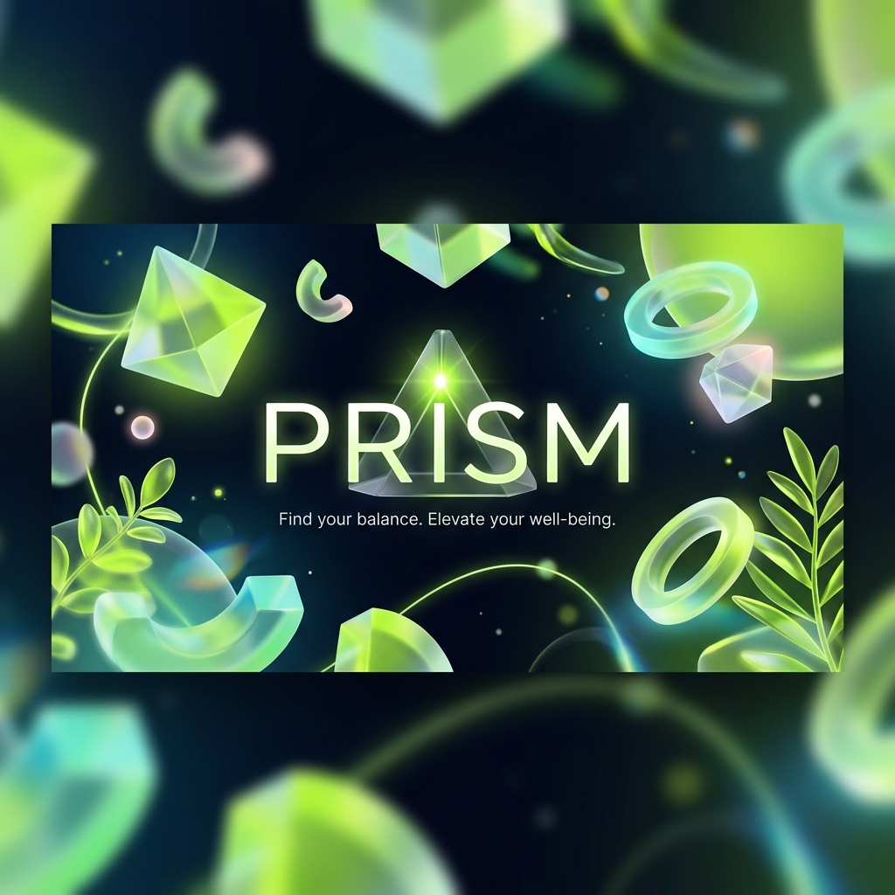

  

  # ✦ Prism ✦

  **A highly interactive wellness app featuring a parametric breathing FSM, a 2D valence-arousal mood grid with real-time HSL background interpolation, and a 7-day emotional drift scatter plot journal.**

  
  
  
  

  [Features](#-features) • [Tech Stack](#%EF%B8%8F-tech-stack) • [The Team](#-the-team) • [Hackathon Story](#-hackathon-story)

---

## 🌟 About The Project

**Prism** is a modern, visually stunning web application designed to help users track and improve their mental wellness. Through an aesthetic interface that heavily features glassmorphism and 3D interactions, it provides various tools for introspection and relaxation.

## ✨ Features

- 🫁 **Parametric Breathing (FSM):** Guided breathing exercises driven by a Finite State Machine to help center yourself.
- 🎨 **Mood Grid:** A unique 2D valence-arousal mood grid with real-time HSL background color interpolation reflecting your emotions.
- 📓 **Emotional Drift Journal:** A powerful 7-day scatter plot journal that visualizes how your mood changes over time.
- 🧊 **Interactive 3D Elements:** Beautiful interactive 3D elements powered by Spline, giving the application a premium feel.

## 🛠️ Tech Stack

Prism is built using modern web technologies to ensure a fast, responsive, and engaging user experience:

- **Frontend:** React 18, Vite
- **Styling:** TailwindCSS, Radix UI, Framer Motion
- **3D Graphics:** Spline (`@splinetool/react-spline`)
- **Data Visualization:** Recharts
- **Icons:** Material Icons, Lucide React

## 🏆 Hackathon Story

Prism was built during the **Horzon Hackathon**, held at the **Shri Bhagubhai Mafatlal Polytechnic and College of Engineering**.

Though we didn't take home the grand prize, building Prism was an incredible journey of learning, late-night coding, and teamwork. We successfully delivered a fully functional, highly polished, and visually stunning application within the strict time limits of the hackathon!

## 🤝 The Team

*   **[Aryan]** - Team Leader & Code Integration 💻
*   **[Garva Juthani]** - 3D Elements & Spline Integration 🧊
*   **[Raj Sanghvi]** - UI/UX & Figma Design 🎨

---

  
Made with brightness · Prism ✦

